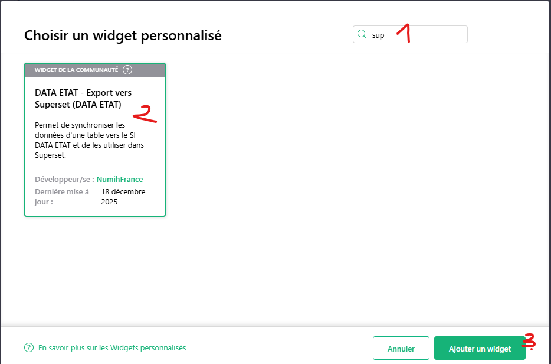
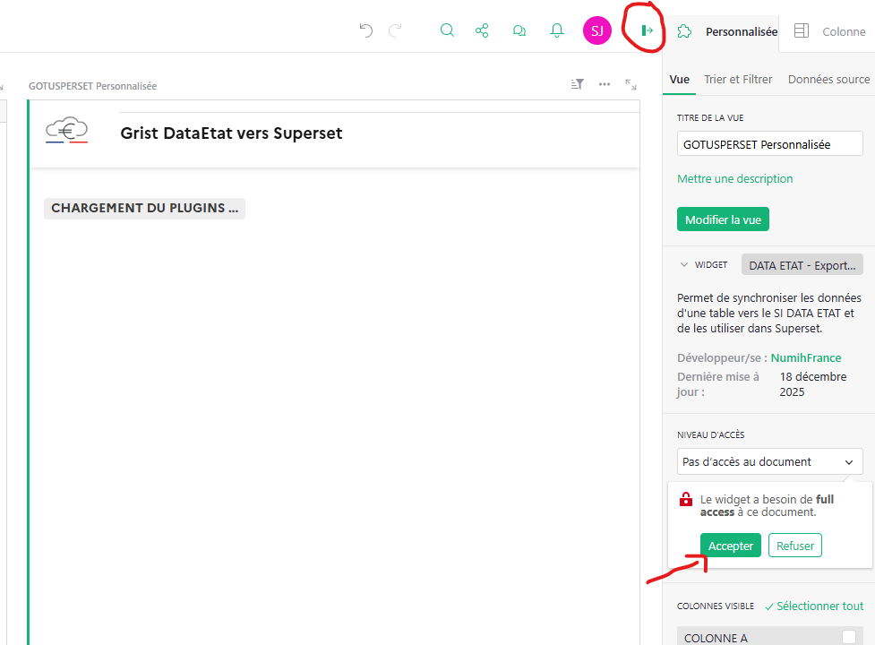
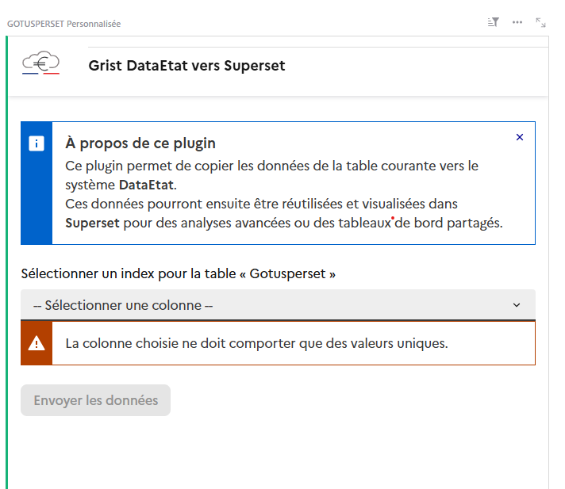

# Grist vers Superset – Documentation d’utilisation

## Utilisation rapide

**Étapes pour exporter vos données Grist vers Superset :**
1. Connectez-vous à Grist : [grist.dataregion.fr](https://grist.dataregion.fr)
2. Ouvrez le document que vous souhaitez intégrer avec Superset DataEtat.
3. Sélectionnez la table de données à exporter.
4. Cliquez sur le bouton **Nouveau** puis choisissez : « Ajouter une vue à la page » > **Personnalisée** > votre table, puis cliquez sur **Ajouter à la page**. 
5. Dans la liste, recherchez « Superset »  et sélectionnez **Data ETAT - Export vers Superset**, puis cliquez sur **Ajouter un widget**.
6. Une page « Grist DataEtat vers Superset » s’ouvre avec la mention « Chargement du plugin... ».
7. Ouvrez le panneau de configuration du plugin et mettez le niveau d’accès du plugin à **Accès complet au document**. 
8. Le plugin s’affiche complètement. Suivez la marche à suivre indiquée dans la page du plugin. 

## Limitations

- **Colonne d’identifiants uniques obligatoire** :
  - Chaque table Grist à exporter doit comporter une colonne contenant des identifiants uniques pour chaque ligne.
- **Colonnes ignorées** :
  - Les colonnes de type « liens vers d’autres tables » (relations) sont ignorées lors de l’export.
  - Les colonnes contenant des pièces jointes (fichiers, images, etc.) sont également ignorées.
- **Types de données** :
  - Certains types de données complexes ou personnalisés peuvent ne pas être parfaitement convertis.
 - **Initialisation du DataSet** :
  - DataEtat initialise un DataSet contenant toutes les données de la table du document Grist et l’associe à l’utilisateur.
  - Il revient ensuite à l’utilisateur de créer/partager les graphiques et dashboards dans Superset à partir de ce DataSet.

Pour toute question ou contribution, merci de contacter l’équipe projet.
